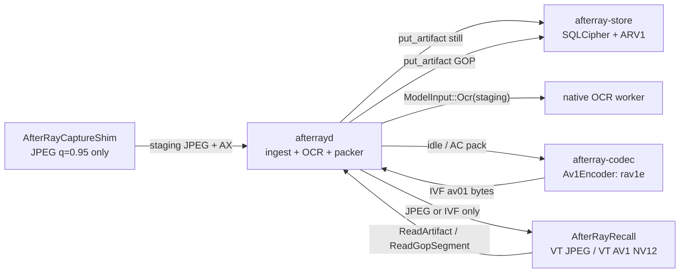
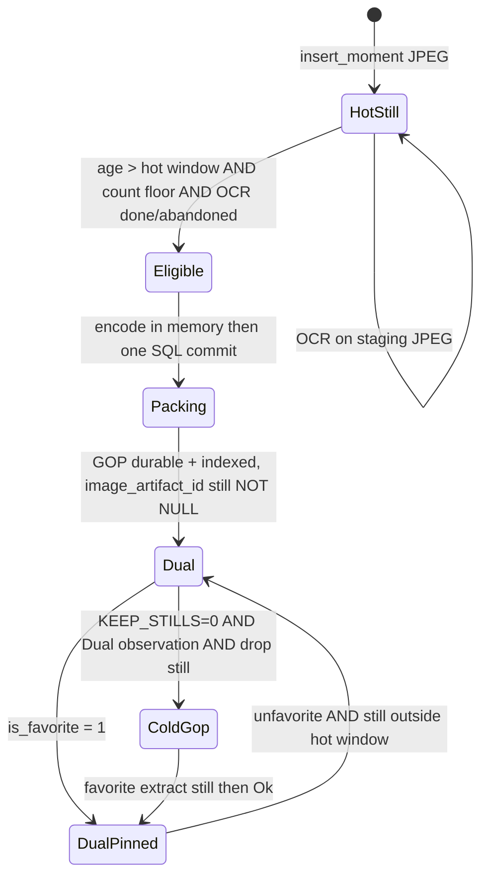
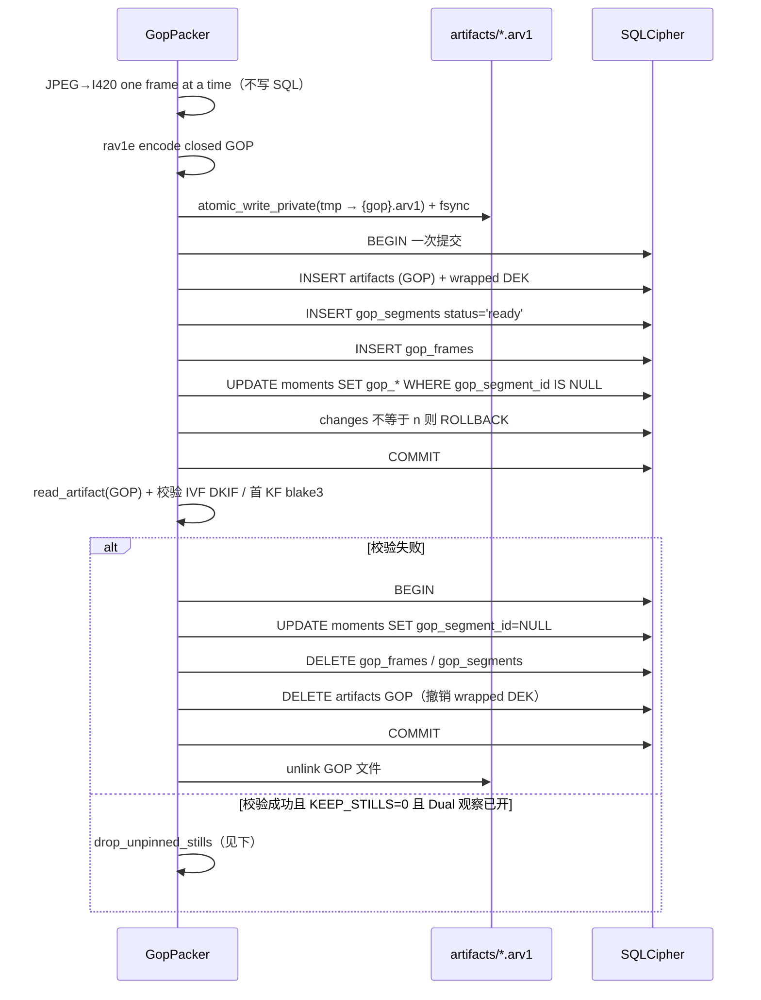

# 热窗口独立帧 + 冷 rav1e GOP 归档

| 字段 | 值 |
| --- | --- |
| 作者 | AfterRay Engineering（草稿） |
| 日期 | 2026-08-13 |
| 状态 | Draft（对抗复审修订 4） |
| 适用范围 | macOS 本地记忆；`afterrayd` / Vault / Recall |
| 关联 | `docs/afterray-v1-spec.md` §9、`docs/vault-encryption-design.md`、`docs/afterray-v0-implementation-plan.md` |

## Overview

当前 AfterRay 每个 Moment 落一份独立 JPEG（capture shim `q=0.95`，约 1.03 MiB / 3456×2234）。本机 4.0h / 1429 条实测 Vault 里图片占 1477 MiB（78%）。按这个密度，一天 8 小时活跃录制会吃掉约 3.0 GiB 截图；24 小时心跳则接近 8.9 GiB。Recall 拖拽已经建立在「一帧一份独立字节、VideoToolbox JPEG → NV12」上：单帧 4.8–5.2ms，±20 prefetch、6 并发、NSCache 48 帧 / 1.5GB。

本设计把存储分成两层，且不改 capture 热路径：

1. **热窗口（最近 2 小时）**：继续用独立 JPEG。拖拽走现有 `RecallJPEGDecoder`。
2. **冷数据**：后台把已关闭、已 OCR 的 still 打成 **closed-GOP AV1**（PoC 编码器 rav1e，schema 写 `av01`）。**GOP = Group of Pictures**：一段自包含的短视频，先有一张完整关键帧（I / keyframe），后面几张只存相对前一帧的差值（P 帧）。默认 6 张 / 约 1 分钟。k12 实测为 JPEG 的 7.0%，k6 为 9.2%。

**容量承诺要降级：** PR 0–7 默认 `KEEP_STILLS=1`（Dual：JPEG + GOP 并存）。用户能感到的「1 GiB → ~280 MiB」只在 PR 8 删未收藏 still 之后；达到用户配置的存储预算时，retention 会从最旧的未收藏 Moment 开始回收。Dual 是安全观察态，不是容量态。

编码策略、加密、删除、迁移全部归 Rust `afterrayd` / `afterray-store`。Swift Recall 只拿编码后的 still 或 GOP 字节，用 VideoToolbox 解成 NV12。Capture shim 继续薄：`SCScreenshotManager` → JPEG → staging。**rav1e 不进 10s 捕获热路径。**

与 `docs/afterray-v1-spec.md` §9.1 的差异（有意为之）：规格草案写的是小时 / 天级 immutable blob pack + `segment+offset+length+codec+hash`。本设计用 **60s closed GOP**（默认 `keyint=6`）代替大 pack——更短的删除粒度、更短的 settle 预测链、仍是有界独立密文对象。HEVC 仍不作为冷归档主路径。

## Background & Motivation

### 当前流水线

```text
AfterRayCaptureShim
  SCScreenshotManager.captureImage
  NSBitmapImageRep JPEG q=0.95
  capture-staging/screen-*.jpg
        │
        ▼
afterrayd::import_artifact
  Vault::insert_moment → put_artifact (ARV1, XChaCha20-Poly1305)
  ModelQueue.submit(Ocr { image_path: staging })
        │
        ▼
Recall
  Request::ReadArtifact { artifact_id }
  framed v2: JSON ArtifactMeta + raw bytes
  RecallFrameDecoder.decode → JPEG VT NV12 / else ImageIO RGBA
```

关键实现锚点：

- Capture：`apps/AfterRayCaptureShim/Sources/AfterRayCaptureShim/main.swift` 的 `captureScreen`；间隔由 `AFTERRAY_CAPTURE_INTERVAL_SECONDS`（默认 10）在 `crates/afterrayd/src/main.rs` 决定。
- Vault：`crates/afterray-store/src/lib.rs`，`SCHEMA_VERSION = 5`。`moments.image_artifact_id` **NOT NULL**，一对一指向 `artifacts`。`read_artifact` / `put_artifact` / `delete_artifact_record_and_file` 都按独立对象工作。`cleanup_orphaned_artifact_files` **已经**识别 `.arv1` / `.arv0` / `.*.tmp`。
- 协议：`crates/afterray-protocol/src/lib.rs`，`PROTOCOL_VERSION = 2`。`Request::ReadArtifact`；`ArtifactPayload::header_line()` 先写 JSON header，再跟 `byte_length` 原始字节。树内 **没有** v1 `bytes_base64` daemon；该形状只残留在 `scripts/bench-recall-pipeline.swift`。当前 `UnixSocketDaemonClient` 已经是 framed v2，且要求 `protocol_version == 2` 精确匹配。**不要重新引入 `bytes_base64`。**
- Recall：`RecallYUVDisplay.swift` 的 `RecallJPEGDecoder`；`RecallView.swift` 的 `RecallDecodedImageCache`（48 / 1.5GB，prefetch ±20，6 并发）；`RecallStore.swift` 的 `RecallImageRepository`（128 / 512MB 编码字节）。`RecallMoment.imageArtifactId: String` 非可选。
- Retention：`VaultConfig.max_storage_bytes`（默认 100 GB，从 `settings.json` 的 `storage_limit_bytes` 读取）。按加密采集 artifact 的字节数计算；超限时优先删除最旧的未收藏 Moment，收藏内容保留。`PRAGMA foreign_keys = ON`。
- `jobs` 表已建（5 列：`id, capability, source_id, state, attempts, error`）但从未写入；`JobsList` / `JobRetry` 走内存 `afterray-models::ModelQueue`。Packer **不得**复用这张表。

### 实测（2026-08-13，本机 `.afterray/v0-data`）

| 项 | 值 |
| --- | --- |
| 时长 / 条数 | 4.0h / 1429 moments / 10s |
| 图片 | 1477 MiB（78%） |
| AX JSON | 230 MiB（12%） |
| 音频 | ~153 MiB（8%） |
| SQLite | 32 MiB |
| JPEG 均尺寸 | ~1.03 MiB，多为 3456×2234，少数 1728×1117 |
| App 分布 | Lody 59%，loginwindow 19%，其余 Chrome / ChatGPT / 飞书 |

从已解码 JPEG 像素再编码（**不是**原始 `CVPixelBuffer`）：

| 方案 | 相对 JPEG | 编码耗时 | 备注 |
| --- | --- | --- | --- |
| rav1e still q100 s8 tiles4 | 34.8% | ~0.5s / 帧 | 独立帧 |
| aom AVIF q60 | 22.3% | ~0.4s | ImageIO 解码 17–18ms |
| HEIC q80 | 47.1% | 71ms（硬件） | **ImageIO RGBA 100ms，拖拽禁区** |
| rav1e GOP k12 | **7.0%** | 17s / 36 帧 | KF ~371KB，P ~44KB |
| rav1e GOP k6 | 9.2% | — | 更短 GOP |
| rav1e keyint=1 | 28.8% | — | 接近 still |
| SVT-AV1 CRF30 p8 k12 | 8.4% | 0.8s / 36 帧 | 同容器，可替换编码器 |

1 GiB 当前混合 Vault 外推：rav1e still ~503 MB；GOP k12 ~280 MB；GOP + AX zstd-3 ~180 MB。AX zstd-3 ≈ 原文 19%，正交，**不阻塞本设计**。

Seek / 解码（3456×2234，同一套 rav1e GOP fixture，进程内）：

| 路径 | k12 | k6 |
| --- | --- | --- |
| JPEG VT NV12（当前 Recall） | **4.8–5.2ms** | 同左 |
| JPEG ImageIO RGBA | 13ms | 同左 |
| HEIC ImageIO RGBA | **100ms** | 同左 |
| rav1e still AV1 VT | ~10ms KF + 5ms setup ≈ 15ms | 同左 |
| Persistent `AVAssetReader` NV12：session setup | ~5ms | ~5ms |
| Persistent：KF | ~9.4ms | 同档（~9–10ms） |
| Persistent：后续 P | **1.7–2.2ms** | **1.7–2.2ms** |
| Persistent：poster 已上屏后 settle 到最后一帧 P | 11 × ~2ms ≈ **22ms** | 5 × ~2ms ≈ **10ms** |
| AVImageGen 冷随机落到最后一帧 P（新 session） | **35ms** | **28ms** |
| 12 次随机 GOP seek | 332ms vs 12 张 JPEG ~60ms | — |

M3：有 AV1 **解码** 硬件，**没有** AV1 编码硬件。质量 caveat：实验从 JPEG q95 转码；GOP Y PSNR ~26dB **不是**验收指标，必须用 OCR / 小字验证。

**`keyint` 与拖拽无关。** 产品路径是「移动中只显示 poster KF，停下再解 exact P」。KF 体积和 session setup 决定拖拽；`keyint` 只决定 settle 时要从 KF 往后走多少个 P。默认选 6 是因为 **settle 预算 15ms**：k6 ≈ 10ms 能进，k12 ≈ 22ms 超标。35ms / 28ms 的 AVImageGen 冷随机数描述的是「新 session 一次解到最后 P」，**不是**选 6 的理由，也不是拖拽路径。

### 痛点

1. 独立 JPEG 让 Recall 很快，但冷数据磁盘不可持续。
2. 规格 `docs/afterray-v1-spec.md` §9 把 HEVC segment 列为 stage 2，并要求「真实收益后再引入 closed-GOP」。本机数据已经给出 14× 量级（7% vs 100%）。本设计采用 60s AV1 GOP，而不是规格里的小时 / 天级 blob pack。
3. 若把 GOP 放进 capture 热路径，10s 心跳会被 0.5s still / 数秒 GOP 编码打乱，并和 OCR 抢 CPU。
4. 若 IPC 传解码后的 RGBA（3456×2234×4 ≈ 29.4 MB），会直接打穿 Unix socket 和锁屏清理边界。Swift `exchangeArtifact` 的 64 MiB 上限 **挡不住** 29.4 MB RGBA，所以禁令必须在 daemon 侧强制。
5. Favorites 若只活在 GOP 的 P 帧里，取消收藏、单独导出、高画质恢复都会绑死整段 GOP。

## Goals & Non-Goals

### Goals

1. 最近 2 小时 Moment 保持独立 still。延迟分两档，**不要混用**：
   - 热 still **缓存命中**解码 P95 ≤ **8ms**（只计 VT JPEG）。
   - 热 still **未命中**（IPC + 解密 + 解码）P95 ≤ **15ms**。
2. 冷数据以 closed-GOP `av01` 归档；非收藏冷帧存储降到 JPEG 的 ~7–10%。
3. Capture shim 继续只出 JPEG；编码策略在 Rust。
4. OCR / 首次理解走 still，不等 rav1e。
5. Favorites 始终可独立取出高画质 still，不只是 GOP 里的 P 帧。`FavoriteSet` 在独立 still 就绪前不得返回 Ok。
6. 维持现有威胁模型：每对象 AEAD、wrapped DEK、无巨型密文容器。删一条 Moment **立即**从 Timeline / 搜索消失；GOP 像素的物理清除可延迟到整段变空或 compaction（见 Security）。
7. IPC 只传编码字节（`image/jpeg` 或 `video/x-ivf`）。Swift 用 VideoToolbox 解 NV12。Daemon **断言** GOP handler 绝不返回 NV12 / RGBA。
8. Schema 写 `av01`，PoC 编码器 rav1e，后续可换 SVT-AV1。
9. 现有 JPEG Vault 可后台迁移；功能用 flag 关掉时行为与今天一致。`image_artifact_id` 在 Dual / `KEEP_STILLS=1` 期间保持 **NOT NULL**。

### Non-Goals

- 不改 10s 采样策略，不做活动触发 / 自适应帧率。
- 不把 HEVC 作为冷归档主路径。
- 热路径不上 HEIC / AVIF，除非先有 VT NV12 解码器。
- 不做 AX JSON 压缩（可另开 RFC）。
- 本 GOP 阶段不设计按天 retention；按存储预算回收由 Vault 的通用容量设置负责。
- 不在 V0 默认打开 GOP（V0 计划明确「不做 pack」）。
- 不把原始 `CVPixelBuffer` 长期留在磁盘；第一版 packer 从已解码 JPEG 像素再编码。
- 不做跨 GOP 的全局视频文件、不重写整个 Vault 成单一 ciphertext。
- **本阶段不做** GOP compaction（把仍存活帧拷到新段）。逻辑删除后像素仍留在 IVF 里，直到整段被 retention 回收，或后续 compaction PR。
- 不把模型队列持久化进 SQL（Open Question；与 packer job 表分开）。

## Key Decisions

1. **热窗口 = 墙钟 2h 为主、条数地板 360 为辅。** 两者同时满足才允许 pack。
2. **默认 `keyint = 6`，理由是 settle 预算不是拖拽、也不是 35ms AVImageGen。** 拖拽只用 poster KF（k6 / k12 同档 9–10ms + 5ms setup）。poster 已上屏后解到最后一帧 P：k6 ≈ 10ms（≤ 15ms），k12 ≈ 22ms（超标）。存储差很小（24h 心跳 1.49 vs 1.31 GiB）。可配 12，但默认 6。
3. **`image_artifact_id` 在 Dual 期保持 NOT NULL，它就是 still 指针。** 不加 `still_artifact_id`。GOP 成员关系只活在 `gop_segment_id + gop_index`。可空化在 Dual 观察之后（PR 8），并 **bump `PROTOCOL_VERSION` 到 3**；daemon 与 AfterRay.app 必须原子发布。禁止把 GOP artifact id 塞进 `image_artifact_id`。不把「二次有损是否伤 OCR」当作门闩——首次 OCR 发生在 pack 之前，吃的是原始 JPEG。
4. **Favorites（收藏）钉住独立 still。** Pack 可以把已收藏帧写进 GOP，但不得删 still。`set_favorite(true)` 在独立 still 存在（原始 JPEG，或从 GOP 抽出的 JPEG）之前不得 Ok。抽出的帧在数据里打 `still_origin=gop_extract`，**UI 不展示「非原始画质」或任何编码代标记。**
5. **IPC 传编码 GOP，不传 RGBA。** k6 GOP ≈ 0.6 MB。Swift persistent AV1 reader。拖拽只用 KF/poster，停下再解 P。显示路径拒绝非 `image/jpeg` / `video/x-ivf`，并把 framed 上限降到 8 MiB。
6. **热 still 继续 JPEG，不换 HEIC。** JPEG VT NV12 4.8–5.2ms；HEIC ImageIO 100ms。
7. **Schema 记 `codec = av01`，`encoder = rav1e|svt-av1`。** 容器 IVF + SQL 帧索引。
8. **Pack 是 daemon 后台 job，最低优先级。`AFTERRAY_GOP_KEEP_STILLS` 默认 1。** 让路 capture 与 OCR；AC 时 encode。先 Dual 观察，再允许删未收藏 still。**Encode 前不 claim**；一次 `COMMIT ready`。进程启动时回滚残留 `writing`。锁屏不杀 packer。不把 OCR CER 当删 still 前置。
9. **锁屏停捕获、不停 daemon。** 菜单栏休眠；时间轴 idle gap + playhead nil + `idle_spans`。ingest 丢弃 `loginwindow`。GOP 切分只剩 App / 分辨率 / NULL 身份 / `Δt > 30s`。
10. **V0：`AFTERRAY_GOP_ARCHIVE=0`，`AFTERRAY_GOP_KEEP_STILLS=1`。** Schema 6 只做 additive。专用 `gop_pack_jobs` 表，不复用 5 列 `jobs`。

## Proposed Design

### 所有权



- Shim 不感知 GOP。`CaptureConfig.jpeg_quality` 保持 0.95。
- `import_artifact` 的 `ArtifactKind::Screen` 路径仍先 `insert_moment` 再 OCR。**SOF 解析是热路径改动**（今天 `insert_moment` 不看像素格式），必须在 10s ingest 里做完、失败则 width/height 留 NULL，不得解码整图。
- 新 crate `crates/afterray-codec`：`Av1Encoder` trait + rav1e 实现。`afterrayd` 在 pack 时调用，不链进 shim。
- Swift 不读 `.arv1`，不碰 Keychain，不解码密文。

### 生命周期



可见图像来源（**没有**单独的 `still_artifact_id` 列）：

| 状态 | `image_artifact_id` | `gop_segment_id` | 拖拽 | 停下 |
| --- | --- | --- | --- | --- |
| 热 | JPEG NOT NULL | NULL | JPEG | JPEG |
| Dual / DualPinned | JPEG NOT NULL | 有 | JPEG | JPEG |
| Cold（PR 8 之后） | NULL | 有 | GOP poster KF | GOP exact |
| 冷事后收藏 | `gop_extract` JPEG | 有 | 抽帧 JPEG | 抽帧 JPEG |

`KEEP_STILLS=1`（默认）时生命周期停在 Dual：磁盘上 JPEG + GOP 并存，**体积大于今天**。更重要的是 Dual 叠在现有 `insert_moment` → `enforce_retention()` 上——达到存储预算后，每次捕获都可能回收最旧的未收藏 Moment。PR 5 必须先让 retention 认识 `gop_frames` / GOP artifact，否则 Dual 观察期就会 FK 炸掉 10s 热路径。Recall 继续只读 `image_artifact_id`，**不走 GOP 解码**。Cold / NULL 要等 PR 8。PR 7 的 GOP poster 在 Dual 真数据上不可验，必须用 fixture / 无 still 测试行；因此 **PR 6 不得在 PR 7 的 fixture 播放器通过前对 dogfood Vault 默认开 `ARCHIVE=1`**。

### 热窗口定义

| 名 | 默认 | 含义 |
| --- | --- | --- |
| `AFTERRAY_GOP_HOT_WINDOW_SECONDS` | `7200` | 墙钟热窗口 2h；允许 3600–7200 |
| `AFTERRAY_GOP_HOT_MIN_STILLS` | `360` | 至少保留这么多独立 still（1h × 10s 地板） |
| `AFTERRAY_GOP_KEYINT` | `30` | closed GOP 最大帧数；允许 6 / 12 / 20 / 24 / 30。按墙钟连续切，不按 App 分桶 |
| `AFTERRAY_GOP_ARCHIVE` | `1` | 冷区默认归档。设 `0` 才停 packer |
| `AFTERRAY_GOP_OCR_GRACE_SECONDS` | `600` | OCR 未完成也可 pack 的宽限 |
| `AFTERRAY_GOP_REQUIRE_AC` | `0` | 设 `1` 时仅 AC 编码 |

Moment **同时**满足以下条件才可进入候选：

1. `now_ms - captured_at_ms >= HOT_WINDOW_MS`。
2. 按 `captured_at_ms DESC`，它不在最新 `HOT_MIN_STILLS` 条之内。
3. `gop_segment_id IS NULL`。
4. `width IS NOT NULL AND height IS NOT NULL`（JPEG SOF 解析成功）。**SOF 失败的帧不参与 pack，永久留在 JPEG still。**
5. OCR 已完成（`text_evidence.source = 'ocr'`），或 OCR job 终态失败 / 超过 grace。**不**等 embedding / LLM。
6. `AFTERRAY_GOP_ARCHIVE=1`，设备解锁，packer 未被 backpressure 暂停。

热窗口用墙钟而不是 session。锁屏 **只停捕获**，不结束 Vault / OCR / packer。

### 锁屏 / 休眠：停捕获，不停 daemon

产品已拍板：**锁屏和系统休眠都停止捕获**（画面 + 麦克风 + 系统音频）。不写 still、GOP、AX、新音频段。菜单栏显示休眠。时间轴用空档表示这段墙钟。

这与 `docs/afterray-v1-spec.md` §4.2 / §7.2 `lock/sleep → SUSPENDED` 一致。本机 19% `loginwindow` 是 **实现泄漏**：

- 今天只听 `sessionDidResignActive` / `screensDidSleep` / `willSleep`。`Ctrl+Cmd+Q` 锁屏时 session 往往仍 active、屏幕也没睡，shim 继续拍。
- `suspendForSystemLock()` 今天是 `stop()`，把 OCR / ASR / packer / Vault **整进程杀掉**；解锁只清 flag，靠 `keepDaemonAlive` 每秒轮询再拉起。这超过「不要截屏」。
- **新契约：** 锁屏只停 capture shim / 拒绝新 `import_artifact`。daemon 继续跑。心跳默认 10s，通知与进行中的 `captureScreen` 可能交叉，**不能**保证「最多再漏 1 帧」。硬闸是 ingest 丢弃 `loginwindow` + 停后续调度。解锁恢复 shim，不必重启 `afterrayd`。
- 必须补 `com.apple.screenIsLocked` / `Unlocked`。通知可能晚于第一帧，所以 ingest 丢弃是硬闸。
- `screensDidSleep`（只关显示器）与锁屏在时间轴上同属空档，这是有意的。
- 锁屏同时停音频：不能只停画面却留下 300s 麦克风段。

**时间轴空档是三条规则，缺一不可：**

1. `makeRuns`：相邻 Moment `Δt > 30s` 插入 idle gap run，禁止把上一 App 色块拉过空白。
2. `RecallPlayhead.resolve`：playhead 落在 gap 内必须返回 `nil`。今天是「最后一个 `capturedAtMs <= playhead` 的 Moment」，锁 12:00–13:00 时 12:30 仍会显示 11:59 桌面。
3. 主画面：`selectedMoment == nil` 时显示休眠/空，不 decode 上一张 JPEG。

**要持久化原因。** 锁屏、手动暂停、daemon 崩溃、丢权限在墙上钟都是 `Δt > 30s`。解锁/醒来/用户暂停结束时写入 `idle_spans(started_at_ms, ended_at_ms, reason)`，`reason ∈ {lock, sleep, pause}`。时间轴仍画空，长空档可标「休眠」。没有这张表，历史清洗 `loginwindow` 之后锁时段和崩溃无法区分。超过 2 分钟的 gap 在布局上封顶宽度（避免锁 8 小时把时间轴拉成一条空白），墙钟映射仍可用。

历史 `loginwindow` JPEG 不进 packer，后台清理。

### Closed GOP 切分与装配算法

默认 `keyint = 6`：10s × 6 = **60s 墙钟**。GOP **必须 closed**：下一段第 0 帧是独立 KF。

强制关闭（即使未到 keyint）：

1. `bundle_identifier` 变化，**包括 `NULL ↔ Some`**。`IS NULL` 的帧只和同样 `IS NULL` 的邻居成组，不与桌面混。
2. `width` / `height` 变化（`insert_moment` 时从 JPEG SOF 写入；本机已有 3456×2234 与 1728×1117）。`width`/`height` 为 NULL 的行 **不进 walker**（见候选条件 4），因此不存在 `NULL` vs `NULL` 成组后无法填 `gop_segments.width NOT NULL` 的问题。
3. `application_name IS NULL` **且** `bundle_identifier IS NULL`：与上一条的身份键不同则切（身份键定义为 `(bundle_identifier, application_name)`，NULL 是独立键值，不是「沿用上一条」）。
4. `Δcaptured_at_ms > 30s`（锁屏 / 休眠 / 手动暂停自然产生这种洞）。
5. 达到 `keyint`。

不再为 `loginwindow` 做归档。若仍出现该 App 名，视为泄漏：ingest 丢弃、不 pack。身份来自 `attach_accessibility_snapshot`（2s 窗口），失败时两列都是 NULL——必须按 NULL 键切开。

#### Walker（PR 6 必须有的单测）

**禁止 encode 前 claim。** `insert_moment` 每次都会 `enforce_retention()`，候选正是最旧未收藏帧——与 packer 同一集合。若先 `UPDATE moments.gop_segment_id` 再在事务外编码 ~2.8s，retention 可以删掉其中一帧：此时还没有 `gop_frames`，`commit_gop` 会 FK 失败或把 `writing` 段留死。单 `JoinHandle` +「已有 in-flight 则 skip」已经串行化 pack，claim 并不提供并发保护。

```text
pack_tick():
  1. 若 capture_screen 正在跑，或距下次心跳 < 2s，或 OCR semaphore 被占，
     或非 AC，或已有 in-flight encode → return
  2. 可选：INSERT gop_pack_jobs (state='running', payload_json, heartbeat_at_ms)
     **不**写 gop_segments，**不**碰 moments。此行只给活着的 JoinHandle 做 hang watchdog。
  3. SELECT m.id, captured_at_ms, image_artifact_id, bundle_identifier,
            application_name, width, height
       FROM moments m
      WHERE m.gop_segment_id IS NULL
        AND m.width IS NOT NULL AND m.height IS NOT NULL
        AND m.captured_at_ms <= now - HOT_WINDOW_MS
        AND m.id NOT IN (最新 HOT_MIN_STILLS)
        AND (EXISTS ocr evidence OR captured_at_ms <= now - OCR_GRACE)
      ORDER BY m.captured_at_ms ASC, m.id ASC
  4. 线性 fold 成 runs：相邻两行若触发切分规则，则关闭当前 run。
     run 满 keyint 也关闭。
  5. 取最早一个 run：
       n == 0 → skip
       n == 1 → Dual（KEEP_STILLS=1）skip 编码；Cold 才打 AV1 still
       n >= 2 → 编码 closed GOP
  6. 事务外、内存中：逐帧 JPEG→I420（同时只持有 1 张 RGBA 解码缓冲），rav1e。
     成功后再 atomic_write_private 密文。
  7. 一次 SQL 事务（此时才出现 segment 行，且直接 ready）：
       INSERT artifacts (GOP) + wrapped DEK
       INSERT gop_segments (status='ready', artifact_id, width/height 取自编码器输出, ...)
       INSERT gop_frames（全部 n 个物理下标）
       UPDATE moments SET gop_segment_id = :sid, gop_index = …
         WHERE id IN (:ids) AND gop_segment_id IS NULL
       若 changes() != n：ROLLBACK，unlink 刚写的 .arv1，本 run 放弃
         （encode 期间 retention 删了其中一帧；下个 tick 用幸存者重 fold）
       否则 COMMIT
  8. 校验 IVF DKIF / 首 KF blake3。失败见崩溃安全。
```

`payload_json` 至少含 `moment_ids`, `keyint`, `encoder`。encode 中途崩溃 = 无 SQL 残留；孤儿 `.arv1` 由现有 `cleanup_orphaned_artifact_files` 回收。

**启动回滚（与 10 分钟无关）：** `Vault` / `GopPacker` 启动时，**每一条** `gop_segments.status='writing'` 以及匹配的 `gop_pack_jobs.state IN ('pending','running')` 都是孤儿——进程被杀（崩溃、退出、**旧的**整进程锁屏 stop）后不存在仍在跑的 `spawn_blocking`。新契约下锁屏 **不**杀 daemon，in-flight encode 继续。仅进程启动时立即：

1. `UPDATE moments SET gop_segment_id = NULL WHERE gop_segment_id = :sid`（若误留下 claim）
2. segment / job 标 `failed`
3. 若已插入 GOP `artifacts` 行则 `DELETE`（撤 DEK）
4. unlink `{sid}.arv1` / tmp（orphan cleaner 也会收）

不要求「文件能校验则补 `commit_gop`」。PR 5/6 测试：插入 `writing` + 被 claim 的 moments，reopen vault，moments 恢复未认领。

**10 分钟 heartbeat 只用于仍活着的 JoinHandle**（daemon 未死、encode 卡死）。Watchdog 看的是当前进程里的 packer 任务，不是启动恢复。

#### 单帧尾巴例子

同一热窗口外的序列（10s，均已 OCR）：

| # | App | 尺寸 | 动作 |
| --- | --- | --- | --- |
| A B C | Chrome | 3456×2234 | 同身份 |
| D | Feishu | 3456×2234 | 切：身份键变化 |
| E | Feishu | 3456×2234 | 与 D 同组 |
| F | Xcode | 3456×2234 | 切 |
| G | Xcode | 1728×1117 | 切：分辨率 |

产出：

- `ABC`（3 帧）→ closed GOP（提前关，未满 6）
- `DE`（2 帧）→ closed GOP
- `F`（1 帧）→ Dual 下 **先不编码**（显示仍走 JPEG）；仅 `KEEP_STILLS=0` 时才打 `frame_count=1` AV1 still
- `G`（1 帧）→ 同上

`n == 1` 在 Dual 期编码 AV1 still 是浪费：Recall 不会显示它。

若六帧同身份同尺寸无空洞，则一个 k6 GOP。下一帧开新段。

### Packer 调度、背压与资源包络

新组件：`afterrayd` 里的 `GopPacker`，独立 `JoinHandle`。

```text
优先级（高 → 低）
  1. capture_screen / insert_moment / 音频 ingest
  2. OCR（ModelQueue CapabilityConcurrency.ocr = 1）
  3. ASR / embedding
  4. GOP pack（最多 1 个 encode）
```

- 每 5s tick，或一次 ingest 完成后检查。
- **不启动新 pack** 若：`capture_screen` 正在跑；距下次心跳 < 2s（capture-critical section）；OCR semaphore 被占；最近一次 capture 漂移 > 2s；非 AC；已有 in-flight encode。
- 编码在 `spawn_blocking` **单线程**。in-flight encode **不中止**（rav1e 取消代价高）；背压只挡下一票。因此一次 encode 最多与 **一次** 10s capture 重叠。
- **k6 墙钟 / RSS 未用 6 帧 GOP 实测。** 36 帧 k12 约 17s，线性外推 k6 ≈ 2.8s，KF 通常更贵。PR 6 必须打 `encode_ms` 和 `rss_mb`；70 MB 不得当验收。策略：一次只持有 1 张 JPEG 解码缓冲；I420 是否同时留 6 帧取决于 rav1e API。
- 换 SVT-AV1 后预计更快，规则不用改。
- AC：契约 `fn on_ac_power() -> bool`；失败视为 **不在 AC**（fail closed）。**不要** shell `pmset`。Workspace `unsafe_code = "deny"`，`afterray-platform-macos` 今天也没有 IOKit。PR 6 实现路径（三选一，写进该 PR 的 crate 注释）：
  1. **首选：** `afterray-platform-macos` 里一个极小的 `power.rs`：`#![allow(unsafe_code)]` 仅包裹 `IOPSCopyPowerSourcesInfo` / `IOPSGetPowerSourceDescription`，unsafe 块不超过读几个 CF 键。
  2. 或依赖一个已封装 IOKit 的 safe crate（需许可证与体积评审）。
  3. 或薄 Swift helper 经既有 shim 风格 stdout 回 `{"on_ac":true}`——只在 1/2 都不合适时用。
- 不做「用户 idle N 分钟」。

验收：「Pack 不得导致 capture 间隔 P95 相对基线恶化 > 10%」只在上述 critical section 下测量。

### 崩溃安全

Still **只能**在 GOP durable **且** `KEEP_STILLS=0` **且** Dual 观察通过后删除。默认路径在 Dual 停住。不把 OCR CER 当前置。



保证：

- 沿用 `atomic_write_private`（tmp → `sync_all` → rename → parent `fsync`）。
- 事务前提交崩溃：磁盘上可能有孤儿 `.arv1`，**没有** `writing` 行、也没有半挂的 `gop_segment_id`。`cleanup_orphaned_artifact_files` **已经**处理 `.arv1` / `.arv0` / `.*.tmp`。校验失败路径必须 **先删 `artifacts` 行（DEK）再 unlink**。
- 启动见 walker：所有残留 `writing` / `running` job **立刻**回滚，不等 10 分钟。
- Dual 崩溃：多占一份 still。启动跑 `reconcile_packed_stills()`。
- **禁止**先删 still 再写 GOP。
- 明文 YUV / IVF 只在 packer 线程；`Zeroize` drop。进程退出时 OS 收走内存。锁屏不再杀 daemon。

#### `drop_unpinned_stills(segment_id)`（仅 PR 8 之后）

SQLite 没有 `SELECT FOR UPDATE`。必须在 **同一 `BEGIN` 里重新读** `is_favorite`：

```sql
BEGIN;
-- 用户可能刚 FavoriteSet
SELECT id, image_artifact_id, is_favorite
  FROM moments
 WHERE gop_segment_id = ?1
   AND image_artifact_id IS NOT NULL;

-- 对 is_favorite = 0 的行：
UPDATE moments SET image_artifact_id = NULL
 WHERE gop_segment_id = ?1
   AND is_favorite = 0
   AND image_artifact_id IS NOT NULL;
DELETE FROM artifacts WHERE id IN (刚才选出的未收藏 still id);
COMMIT;
-- 然后 unlink 那些 still 文件
```

`WHERE is_favorite = 0` 放在 UPDATE 里，避免 packer 与 `set_favorite` 竞态把刚钉住的 still 删掉。

#### `reconcile_packed_stills()`

启动时扫描：`gop_segments.status='ready'` 且 `moments.image_artifact_id IS NOT NULL` 的 Dual 行。若当前 flag 下该行 **本来就该 drop**（`KEEP_STILLS=0`、出热窗口、`is_favorite=0`、GOP ready），则走 `drop_unpinned_stills`。否则留下 Dual。`KEEP_STILLS=1` 时本函数是 no-op。

启动时任何 `gop_pack_jobs.state IN ('pending','running')` 立刻标 `failed`（进程已死，不是 hang）。Heartbeat > 10 分钟只在 **当前进程** 的 packer JoinHandle 上触发 abort/skip 下一票。

### Favorites

`Vault::set_favorite`：

- `favorite = true`：
  1. 若 `image_artifact_id IS NOT NULL`：只 `UPDATE is_favorite = 1`。随后 pack / drop / reconcile 都跳过。
  2. 若 `image_artifact_id IS NULL`（仅 PR 8 后的 Cold）：**不要**在 `FavoriteSet` 同步路径里解密+解 AV1+再压 JPEG。提交 `gop_extract` job，响应先带 `is_favorite=false` / `extracting=true`；job 完成后再 `is_favorite=1` 并推读模型。抽帧期间 UI 保持旧画面、禁用再点。
  3. 抽帧失败：**不**改 `is_favorite`，job 标 failed。Goal 5：收藏成功 ⇒ 独立 still 一定在。
- `favorite = false`：`is_favorite = 0`；若已出热窗口且 GOP ready 且 `KEEP_STILLS=0`，下一次 reconcile 可删 still。

`FavoriteSet` 的 JSON 成功体必须带回最新读模型：

```json
{"moment_id":"…","is_favorite":true,"image_artifact_id":"…","still_origin":"gop_extract","gop":{…}}
```

Swift `toggleFavorite` 今天乐观翻转布尔、不重载图像。PR 7 / 8：Cold 点星走异步 extract job，完成后再刷新 `image_artifact_id`。禁止把 0.6 MB 解密 + AV1 decode + JPEG encode 放在 ingest 同线程的 JSON handler 上。

拖拽收藏帧永远走独立 still。GOP 里仍保留该帧，便于邻帧 prefetch 和未来 compaction。

### `moments.image_artifact_id` 如何演变

今天：`image_artifact_id TEXT NOT NULL REFERENCES artifacts(id)`。Rust `Moment.image_artifact_id: String`。Swift `RecallMoment.imageArtifactId: String`。`moment_from_row` / `enforce_retention` / Visual Lab mocks / `DaemonWireTests` 全部当必填。

**Schema 6（PR 1，additive，不重建表）：**

- `image_artifact_id` **保持 NOT NULL**。它就是 still 指针。
- **不加** `still_artifact_id`（与 `image_artifact_id` 恒等，只多一对 FK 和双写 bug）。
- `ALTER TABLE moments ADD`：`gop_segment_id`、`gop_index`、`still_origin`（`DEFAULT 'capture'`）、`width`、`height`。
- 新表 `gop_segments`、`gop_frames`、`gop_pack_jobs`。

**Schema 7 / 协议 v3（PR 8，Dual 观察通过后）：**

- 显式 `migrate_moments_schema_7`：关 FK → 建新表（`image_artifact_id` 可空）→ 拷贝 → 换名 → 重建索引 → 开 FK。用 v5/v6 fixture vault 做打开测试。这是新的、会挡住 `Vault::open_with_key` 的路径；**不要**假装它等于今天的 `migrate_artifact_columns`（后者只 `ALTER TABLE artifacts ADD COLUMN`，仓库里没有 rebuild-copy-rename）。
- `PROTOCOL_VERSION = 3`。`Moment.image_artifact_id: Option<String>`。Swift 同步改。混用旧 App + 已 drop still 的 Vault **不支持**；`UnixSocketDaemonClient` 对 version 已经是精确匹配，旧客户端会直接 `protocolMismatch`，而不是在 `timeline_list` 上静默炸 decoder。

不把 GOP artifact id 塞进 `image_artifact_id`：`read_artifact` 会整段返回 IVF，旧 UI 会当 JPEG 喂给 `RecallFrameDecoder`。

### 编码与容器

新 crate `afterray-codec`：

```rust
pub struct GopFrameInput<'a> {
    pub moment_id: &'a str,
    pub captured_at_ms: i64,
    pub width: u32,
    pub height: u32,
    /// 8-bit I420, stride-aligned. Packer 从 JPEG 解码得到。
    pub yuv: &'a [u8],
}

pub struct EncodedGop {
    pub codec: &'static str,      // "av01"
    pub encoder: String,          // "rav1e" | "svt-av1"
    pub encoder_version: String,
    pub width: u32,
    pub height: u32,
    pub keyint: u16,
    pub ivf: Vec<u8>,
    pub frames: Vec<EncodedGopFrame>,
}

pub struct EncodedGopFrame {
    pub index: u16,
    pub is_keyframe: bool,
    pub byte_offset: u32,
    pub byte_length: u32,
    pub content_hash: [u8; 32],   // blake3 of compressed frame
}

pub trait Av1Encoder: Send {
    fn encode_closed_gop(&self, frames: &[GopFrameInput<'_>]) -> Result<EncodedGop, CodecError>;
}
```

- 容器：**IVF**。32 字节文件头（magic `DKIF`）+ 每帧 12 字节 frame header（size + pts）+ OBU。
- PR 3 必须提交一份 **golden IVF fixture**（小分辨率 + 一份 3456 宽的文档化 header hex），供 PR 4 单测。
- `content_type`：`video/x-ivf; codec=av01`。
- rav1e：speed 8、quantizer 100、tiles 4、`keyint` = GOP 长度、关闭跨段 temporal RPS。
- 第一版从 JPEG 解码取 YUV。二次有损。首次 OCR 在 pack 前已完成，不把 CER 当删 still 门闩。视觉抽检即可。

### Recall 解码、playhead 与 prefetch

#### 延迟预算（3456×2234）

| SLO | 定义 | 目标 |
| --- | --- | --- |
| 热 still 缓存命中 | 只计 `RecallJPEGDecoder` | P95 ≤ **8ms** |
| 热 still 未命中 | IPC + 解密 + JPEG VT | P95 ≤ **15ms** |
| 冷拖拽 poster | 已有 encoded GOP 或一次 `ReadGopSegment` 后的 KF | 首 KF P95 ≤ **20ms**（含最多一次 5ms session）；同 session 后续 poster ≤ 15ms |
| 冷 settle exact（k6） | persistent session 已有 KF，再解 1…N 个 P | P95 ≤ **15ms**（k6 实测 ≈ 10ms） |
| 冷 settle exact（k12） | 同上，最多 11 个 P | ≈ 22ms，**超过默认预算**；故默认不用 12 |

禁止：HEIC / 任意 codec 的 ImageIO `ShouldCacheImmediately` RGBA。AV1 **必须**走 VT，不能落到 `decodeWithImageIO`。本阶段 **不做** AV1 软件解码回退；VT 建 session 失败则 fail closed（规格目标是 M3+，硬件 AV1 decode 在范围内）。

#### `RecallAV1Decoder`（PR 4，只对 fixture）

`RecallFrameDecoder.decode` 今天：JPEG magic `FF D8 FF` → VT NV12；否则 ImageIO。IVF magic `DKIF` 绝不能 fall through。

**未证明点：** 延迟数字来自 ffmpeg remux 的 `.mp4` + `AVAssetReader`，**不是**自制 `DKIF` IVF 喂 `VTDecompressionSession`。手搓 av1C / sequence header OBU 是冷路径最长杆。

PR 4 门闩（先于任何产品 UI）：同一份 rav1e IVF，进程内必须出 NV12。两条实现路径，按能跑通的选：

1. **优先验证：** IVF demux → OBU → `CMVideoFormatDescription`（`kCMVideoCodecType_AV1`）→ persistent `VTDecompressionSession`。
2. **若 1 失败：** daemon 或 codec crate 把 IVF 无重编码封装成已验证的 MP4/CMAF（`ffmpeg -c copy` 等价），Swift 走 `AVAssetReader`。schema 仍是 `av01`，content_type 可变为 `video/mp4`。

VT 建 session 失败则 fail closed（M3+ 才承诺冷回放）。本阶段不做软件解码回退。

其余契约：

1. 不要把整段 IVF 当一个 sample。
2. Persistent session 以 `gop_segment_id` 为键。从 KF 顺序 feed 到目标 index。输出 NV12，复用 `ArtifactYUVView`。
3. IPC 载荷是结构完整的 IVF 或上述 MP4，不是裸 OBU，不是 RGBA。
4. 单测：`DKIF` 不得进入 `decodeWithImageIO`。

Daemon `ReadGopFrame` / `ReadGopSegment`：

- AEAD 只能解 **整段** GOP artifact。不能按 offset 解切片。
- **磁盘上的 IVF 在 compaction 之前不可变。** 逻辑删除只摘 `gop_frames` / Timeline，**不得**改密文、不得从 IVF 里抠掉已删帧。P 帧依赖 KF 和更早的 P；retention 删的是最旧帧，抠掉中间样本会让后面的活帧无法解码。
- `ReadGopSegment`：解密后返回 **完整** 原始 IVF（与落盘一致）。这就是已文档化的 DEK 延迟：持有 GOP DEK 仍能看见已删像素的压缩样本。
- `ReadGopFrame { index }`：若 `gop_frames` 没有该 index 的活行 → **not found**（授权 / 读模型规则）。
- `ReadGopFrame poster`（活 index）：返回结构完整的 1 帧 IVF = 头 + **该 index 对应的 KF 压缩样本**（closed GOP 里即第 0 帧）。不要求改磁盘。
- `ReadGopFrame exact`（活 index N）：返回结构完整的 IVF = 重写头的 `frame_count` 后，包含 **KF→N 的全部物理样本，包括中间已被逻辑删除、但仍被 N 预测依赖的帧**。隐藏是「不许点名已删下标」，不是「切片里跳过它们」。
- CLI `gop show` / Timeline 只列出仍在 `gop_frames` 的 moment。Recall 只对读模型里的活 `gop_index` 发 `ReadGopFrame`。
- `byte_length` = 返回的明文 IVF 长度。Handler 断言 `content_type` 只能是 `video/x-ivf; codec=av01` 或（still）`image/jpeg`。

必测（PR 5 + PR 2/4）：**pack 6 帧 → retention 掉 index 2 → 解码活着的 index 5 必须成功；`ReadGopFrame(segment, 2)` 必须失败。** `ReadGopSegment` 仍返回 6 个压缩帧。

#### Playhead 状态机（PR 7，不在 PR 4）

当前代码 **做不到** drag=KF / settle=exact：

- `ImmersiveArtifactImage.task(id: artifactID)` 每次 playhead 变化都加载 **exact** `imageArtifactId`。
- `prefetchAroundSelection` 把 ±20 映射成那些 id。
- `dragOrigin` 只在拖动手势里设置；滚轮 / 方向键 / 搜索跳转都不设。
- 没有 80ms settle 计时器。

PR 4 只交付 decoder + fixture 测试。产品策略全部放 PR 7。

```swift
enum RecallFrameRef: Hashable {
    case still(artifactId: String)
    case gopPoster(segmentId: String, keyframeIndex: UInt16)
    case gopExact(segmentId: String, index: UInt16)
}
```

规则（拖拽、滚轮、方向键、搜索命中、远点击 **同一套**）：

- 若 `Date.now - lastPlayheadChange < 80ms` **或** `dragOrigin != nil` → 有 still 则 `still`，否则 `gopPoster`。
- 否则 → 有 still 则 `still`，否则 `gopExact`。
- 远跳不得为了上屏同步解开整条预测链。

`prefetchAroundSelection`：按 `segment_id` 合并；一个 k6 GOP 在 ±20 窗口里最多一次 `ReadGopSegment`。Encoded GOP cache 最多 16 段（~10–13 MB）。Persistent VT session 最多 2 个（当前 + 运动方向上一个）。

`RecallDisplayedFrame.choose` 的 id 改用 `RecallFrameRef`，避免中段落地时仍显示上一张 JPEG。

锁屏：`.afterRaySystemSessionWillSuspend` 已清 JPEG 缓存（`AfterRayApp.swift`）。PR 7 必须同时 invalidate GOP encoded cache 和 VT session。

## API / Interface Changes

### Protocol

**到 PR 7 为止保持 `PROTOCOL_VERSION = 2`，加法字段。`image_artifact_id` 仍是必填 `String`。** 把该字段改成 `Option` 是破坏性变更：当前 Swift `JSONDecoder` 会在第一条 packed 冷行上让整个 `timeline_list` 失败；客户端又要求 version == 2，静默破坏比 bump 更糟。

```rust
pub enum Request {
    // 现有 …
    ReadArtifact { artifact_id: String },
    ReadGopSegment { segment_id: String },
    ReadGopFrame {
        segment_id: String,
        index: u16,
        mode: GopReadMode,
    },
}

pub enum GopReadMode { Poster, Exact }

pub struct Moment {
    pub image_artifact_id: String, // PR 8 之前保持 String
    pub gop: Option<GopRef>,       // 加法
    pub still_origin: String,      // "capture" | "gop_extract"；缺省 "capture"
    // width/height 不进 timeline 热路径也可；pack 用 DB 列
}

pub struct GopRef {
    pub segment_id: String,
    pub index: u16,
    pub keyframe_index: u16,
    pub frame_count: u16,
    pub codec: String, // "av01"
}

pub struct FavoriteSetResult {
    pub moment_id: String,
    pub is_favorite: bool,
    pub image_artifact_id: String,
    pub still_origin: String,
    pub gop: Option<GopRef>,
}
```

PR 8：`PROTOCOL_VERSION = 3`，`image_artifact_id: Option<String>`（Cold 行）。`DaemonWireTests` + Visual Lab mocks + `moment_from_row` + 三条 timeline 查询 + `RecallImageLoader` 在 **同一变更集** 改完。

`ReadGopSegment` / `ReadGopFrame` 复用 `write_artifact_response`：JSON header + 原始 IVF。禁止 `bytes_base64`。树内没有 v1 daemon 可对 GOP 失败——只有 v2 framed。

`ArtifactMeta` 加法：

```rust
pub struct ArtifactMeta {
    pub id: String,
    pub content_type: String,
    pub byte_length: u64,
    #[serde(default)]
    pub codec: Option<String>,
    #[serde(default)]
    pub gop_index: Option<u16>,
    #[serde(default)]
    pub keyframe_index: Option<u16>,
}
```

| 请求 | 返回 | 大小 |
| --- | --- | --- |
| `ReadArtifact` | **只接受 still JPEG id**。GOP `artifact_id` 走 `ReadGopSegment`。显示路径误传 GOP id → 明确错误，禁止把 IVF 喂给旧 `RecallFrameDecoder` | JPEG ~1.0 MB |
| `ReadGopSegment` | **完整**落盘 IVF，不省略已删帧 | k6 ~0.6 MB，k12 ~0.85 MB |
| `ReadGopFrame poster`（活 index） | 头 + 该 GOP 的 KF 样本 | ~371 KB |
| `ReadGopFrame exact`（活 index N） | 头 + KF→N **全部物理样本**（含已逻辑删除但仍被预测依赖的参考帧） | ≤ GOP |
| `ReadGopFrame` 已删 index | JSON 错误，无 body | — |

推荐客户端：prefetch `ReadGopSegment`，本地 persistent decode。

Swift 显示路径：`byteLength > 8 * 1024 * 1024` 或 `contentType` 不是 `image/jpeg` / `video/x-ivf` 前缀 → 拒绝。音频继续走现有 64 MiB 上限。

`afterray-cli`：`afterray gop show <segment>` 列出仍在 `gop_frames` 的活 index（dump 整段 IVF 时不抠帧）。`afterray pack status` 读 `gop_pack_jobs`，**不**走 `Request::JobsList`。

### Daemon 处理

`handle()` 里与 `ReadArtifact` 并列走 framed 路径。GOP handler 在组包后断言 content type。`ReadGopFrame exact` **不得**在 daemon 里解码再发 NV12/RGBA。

## Data Model Changes

`SCHEMA_VERSION`：5 → **6** 只做 additive。可空化是以后的 schema 7。

```sql
-- PR 1：ALTER TABLE moments ADD COLUMN（全部可空或有 DEFAULT，无需 rebuild）
ALTER TABLE moments ADD COLUMN gop_segment_id TEXT REFERENCES gop_segments(id);
ALTER TABLE moments ADD COLUMN gop_index INTEGER;
ALTER TABLE moments ADD COLUMN still_origin TEXT NOT NULL DEFAULT 'capture';
ALTER TABLE moments ADD COLUMN width INTEGER;
ALTER TABLE moments ADD COLUMN height INTEGER;
-- image_artifact_id 保持 TEXT NOT NULL

CREATE TABLE gop_segments (
  id TEXT PRIMARY KEY,
  artifact_id TEXT UNIQUE REFERENCES artifacts(id), -- 一次提交为 ready 时非空
  codec TEXT NOT NULL,              -- 'av01'
  encoder TEXT NOT NULL,
  encoder_version TEXT,
  width INTEGER NOT NULL,           -- 来自编码器输出，不是 SOF NULL
  height INTEGER NOT NULL,
  frame_count INTEGER NOT NULL,
  keyint INTEGER NOT NULL,
  started_at_ms INTEGER NOT NULL,
  ended_at_ms INTEGER NOT NULL,
  status TEXT NOT NULL,             -- 'writing' | 'ready' | 'failed'
  content_hash TEXT                 -- ready 后非空
);

CREATE TABLE gop_frames (
  segment_id TEXT NOT NULL REFERENCES gop_segments(id) ON DELETE CASCADE,
  frame_index INTEGER NOT NULL,
  moment_id TEXT NOT NULL UNIQUE REFERENCES moments(id) ON DELETE CASCADE,
  is_keyframe INTEGER NOT NULL,
  byte_offset INTEGER NOT NULL,
  byte_length INTEGER NOT NULL,
  content_hash TEXT NOT NULL,
  PRIMARY KEY (segment_id, frame_index)
);

CREATE TABLE gop_pack_jobs (
  id TEXT PRIMARY KEY,
  segment_id TEXT REFERENCES gop_segments(id),
  state TEXT NOT NULL,              -- pending | running | done | failed
  attempts INTEGER NOT NULL DEFAULT 0,
  created_at_ms INTEGER NOT NULL,
  updated_at_ms INTEGER NOT NULL,
  heartbeat_at_ms INTEGER,
  payload_json TEXT NOT NULL,
  error TEXT
);

CREATE INDEX moments_gop ON moments(gop_segment_id, gop_index);
CREATE INDEX moments_hot_pack ON moments(captured_at_ms, gop_segment_id, is_favorite);
CREATE INDEX gop_pack_jobs_state ON gop_pack_jobs(state, heartbeat_at_ms);
```

**不**复用 `jobs`。那张表没有时间戳 / heartbeat / payload，且 `JobsList` 已经表示模型任务。模型持久化仍是 Open Question。

PR 0 另加（可与 schema 6 分开、也可并进 PR 1）：

```sql
CREATE TABLE idle_spans (
  id TEXT PRIMARY KEY,
  started_at_ms INTEGER NOT NULL,
  ended_at_ms INTEGER,
  reason TEXT NOT NULL  -- 'lock' | 'sleep' | 'pause'
);
```

`insert_moment`：仍 `put_artifact("image/jpeg", …)`；解析 SOF 写 `width`/`height`。**SOF 失败则两列保持 NULL，该 Moment 永不进 packer**（继续独立 JPEG）。`still_origin = 'capture'`。`gop_* = NULL`。`gop_segments.width/height` 在 `ready` 时用编码器输出填写，不在 encode 前用 NULL 去 INSERT。

### Retention 与 FK 顺序

`open_keyed_database` 开了 `PRAGMA foreign_keys = ON`。今天先删 `moments` 再删 `artifacts` 合法，因为只有 `moments → artifacts`。加上 `gop_frames.moment_id → moments` 和 `moments.gop_segment_id → gop_segments` 之后，乱序会在下一次 `insert_moment` → `enforce_retention`（10s 热路径）上炸。

`gop_frames.moment_id` 带 `ON DELETE CASCADE` 是安全网；**仍然**规定显式顺序，并加 store 测试：pack 6 帧 GOP，retention 掉最旧一帧。

同一事务内：

1. 选出将死的未收藏 Moment（现有 `ORDER BY captured_at_ms ASC LIMIT excess`）。
2. `DELETE FROM gop_frames WHERE moment_id IN (…)`（CASCADE 也会做，但显式更清晰）。
3. `DELETE FROM moments WHERE id IN (…)`。
4. `DELETE FROM gop_segments WHERE id NOT IN (SELECT DISTINCT gop_segment_id FROM moments WHERE gop_segment_id IS NOT NULL) AND id NOT IN (SELECT DISTINCT segment_id FROM gop_frames)`。
5. `DELETE FROM artifacts`：将死 Moment 的 still，以及第 4 步删掉的段的 `artifact_id`。**这是 wrapped DEK 消失的时刻**，与今天一致。
6. `COMMIT`，然后 `unlink` 文件。

GOP 里还有存活帧时 **不**重写 IVF（磁盘对象不可变）。该下标从 Timeline / 搜索 / `gop_frames` 消失；压缩样本仍按原物理下标留在 IVF 里，供 KF→N 解码。时间轴对该刻显示 gap（规格 §9.4.7）。

必测：pack 6 → 删 index 2 → decode 活 index 5 成功；`ReadGopFrame(..., 2)` not found。

PR 1 的 retention 只需能跑（GOP 表为空时与今天相同）。PR 5 加上引用计数删除。PR 8 才允许 still 为 NULL。

### 加密

GOP 是 **一个** 有界 artifact（k6 ~0.6 MB，k12 ~0.85 MB），不是历史总容器：

- 复用 `encrypt_artifact` / `decrypt_artifact`。独立随机 DEK，AAD 绑定 `id + content_type`（`video/x-ivf; codec=av01`）。
- 删收藏 = 删独立 still + 其 DEK，不动 GOP DEK。
- 删 GOP 内 **最后一条** 存活帧 = 删 GOP artifact + 其 DEK。
- **新不变量（相对 `docs/vault-encryption-design.md` §5）：** 逻辑删除立即从 Timeline、FTS、Agent 结果中隐藏该 Moment，并删掉 `gop_frames` 行。该帧的压缩样本 **必须留在不可变 IVF 里**，否则后续活着的 P 无法解码。持有 GOP DEK 的人解密 `ReadGopSegment` 仍能看见整段字节——这就是 DEK 延迟。`ReadGopFrame(已删 index)` 与 Timeline / CLI 列表拒绝点名该下标（授权规则，不是抠字节）。物理像素清除推迟到整段变空（retention 第 4–5 步）或 compaction。这是对「逻辑删除即撤销对应 DEK」的 **有意放宽**，范围限于 ≤12 帧 / ≤1 MB 的段。
- Fast-follow compaction 触发（**本阶段不实现**，单独 PR）：存活帧 < 50%，或收藏删除发生在 GOP 成员上且用户期望尽快清像素。Compaction = 把 live/pinned 帧拷到新 GOP，原子切换 `gop_segments.artifact_id`，删旧 artifact（旧 DEK 消失）。

明文 IVF 只存在于 packer 线程、`ArtifactPayload`（已有 `Drop` + `zeroize`）、Swift 有界 encoded cache。

## 存储模型

假设 10s 间隔、JPEG 1.03 MiB、3456×2234。

| 层 | 公式 | 1h | 2h | 8h 活跃 | 24h 心跳 |
| --- | --- | --- | --- | --- | --- |
| 全 JPEG | `n × 1.03 MiB` | 371 MiB | 742 MiB | 2.97 GiB | 8.90 GiB |
| 热 JPEG 2h + 冷 k12 7.0% | `min(n,720)×1.03 + max(n-720,0)×1.03×0.07` | 371 MiB | 742 MiB | 900 MiB | 1.31 GiB |
| 热 JPEG 2h + 冷 k6 9.2% | 同上 ×0.092 | 371 MiB | 742 MiB | 952 MiB | 1.49 GiB |
| Dual（KEEP_STILLS=1，2h 热 + 冷 JPEG+GOP） | 全 JPEG + 冷 GOP | — | — | 全 JPEG + ~0.2 GiB | 更高；故 Dual 只作观察窗 |
| 全 rav1e still 34.8% | | 129 MiB | 258 MiB | 1.03 GiB | 3.10 GiB |
| 全 GOP k12 | | 26 MiB | 52 MiB | 208 MiB | 623 MiB |

本机 4.0h **整库**约 1892 MiB（图 1477 + AX 230 + 音频 153 + sqlite 32）。只改图、且 Dual 未删 still 时，整库会变成约 **1892 + 70 ≈ 1960 MiB**。PR 8 删 2h 以外未收藏 JPEG 后，图片层约 740 + 68 ≈ 808 MiB，整库约 **1.2 GiB**——不是 280 MiB。1 GiB「当前混合库」外推的 280 MiB 是 **假设全部已 Cold、且无 Swiss-cheese GOP**。

`maxUnstarredMoments = 10000`（约 28h @ 10s）会一帧一帧挖空 GOP。无 compaction 时，稳态磁盘接近「整段 IVF 活 1–2 帧」，9% 收益会爬回去。**本设计不交付 1 GiB → 280 MiB**；那是 PR 8 + 后续 compaction 的目标。

## Alternatives Considered

### A. 全部独立 AV1 / AVIF still，不做 GOP

- 收益：随机 seek / 删除简单，IPC 仍是单对象。
- 代价：rav1e still 仍是 JPEG 的 34.8%；一天 8h 仍约 1.0 GiB。达不到冷数据 14×。
- 结论：可作编码器 PoC 中间步（先通 AV1 VT），不能当终态。

### B. HEVC closed GOP（规格 §9 stage 2）

- 收益：M3 硬件编码；KF VT NV12 ~6ms。
- 代价：绑死 VideoToolbox；schema 写 `hvc1` 就难换 SVT-AV1。
- 结论：不采用。慢则换 **SVT-AV1**（同 `av01`）。

### C. 在 capture 热路径编码 / 保留 CVPixelBuffer

- 收益：避免 JPEG→YUV 二次有损。
- 代价：shim 变厚；10s 路径出现数秒编码；明文 raw 过 staging。
- 结论：拒绝。

未采用：整库一个加密视频文件；IPC 传 RGBA；热路径 HEIC；复用 5 列 `jobs` 表当 packer 状态机。

## Security & Privacy Considerations

| 风险 | 严重度 | 缓解 |
| --- | --- | --- |
| 用户删除的截图仍能经 GOP DEK / `ReadGopSegment` 恢复 | 高 | Timeline/搜索立刻隐藏。产品上这是「删除延迟到整段空或 compaction」，不是即时粉碎。用户主动删除尴尬帧若要立刻清像素，走后续 compaction，不在本阶段。`ReadGopFrame(已删 index)` 拒绝点名 |
| GOP 准巨大容器 | 高 | ≤ 12 帧 / ≤ ~1 MB；不重写历史 |
| 先删 still 后编码失败 | 高 | Dual 默认；先 durable GOP + 校验；失败删 GOP `artifacts`（DEK）+ unlink，moments 回到纯 still |
| Packer 明文落盘 | 高 | 只在内存；`atomic_write_private` 只写密文 |
| GOP 密文被挪到另一行 | 中 | AAD 绑定 id + content_type |
| IPC 泄露 29.4 MB RGBA（64 MiB 客户端上限挡不住） | 中 | Handler 断言只要 JPEG/IVF；显示路径 8 MiB + content-type 白名单 |
| 锁屏后 GOP 缓存残留 | 中 | 挂到现有 `clearSensitiveData` |
| 收藏没有独立 still | 中 | `set_favorite(true)` 在 still 就绪前不 Ok |
| 锁屏仍漏拍 `loginwindow` | 中 | 通知 + ingest 硬丢弃；packer 跳过 |
| 旧客户端把 IVF 当 JPEG | 低 | Dual 期 `image_artifact_id` 仍是 JPEG；Cold 只随协议 v3 原子发布 |

Auth 不变：Swift 不持钥。锁屏 **不停** daemon；packer 可继续。只有进程退出才清内存。

## Observability

| 事件 | 字段 |
| --- | --- |
| `gop.pack.start` | segment_id, frame_count, keyint, width, height, reason |
| `gop.pack.done` | encode_ms, ivf_bytes, ratio_vs_jpeg, encoder, rss_mb |
| `gop.pack.fail` | error, keep_stills |
| `gop.still.drop` | moment_id, still_bytes |
| `gop.favorite.extract` | moment_id, quality=gop_extract |
| `gop.backpressure` | reason=capture\|ocr\|battery\|lock\|heartbeat_window |

Recall：`recall.decode.ms` 分桶 `jpeg_hit|jpeg_miss|av1_kf|av1_p`。

验收：

- 热缓存命中解码 P95 ≤ 8ms；热未命中 P95 ≤ 15ms。
- 冷拖拽 poster P95 ≤ 20ms；k6 settle exact P95 ≤ 15ms。
- 不得出现 HEIC/ImageIO 冷拖拽（单帧 ≥ 80ms 视为回归）。
- Pack 不得导致 capture 间隔 P95 相对基线恶化 > 10%（在「不在心跳前 2s 开 encode」的规则下测）。

## Rollout Plan

1. **Schema 6 additive**，flag 关。`image_artifact_id` 仍 NOT NULL。打开旧 Vault 只多几列 NULL GOP 字段。
2. **Protocol v2 加法** + GOP 读 stub。Swift 仍要必填 `imageArtifactId`。
3. **`afterray-codec` + golden IVF fixture。**
4. **Swift AV1 VT** 只打 fixture。确认 NV12，确认不走 ImageIO。不管 playhead。
5. **Store Dual/commit**，still 保持 NOT NULL。没有 drop-to-NULL 路径。
6. **`AFTERRAY_GOP_ARCHIVE=1` 仅开发机**，`KEEP_STILLS=1`。Packer 写 Dual。
7. **Recall `RecallFrameRef` + 80ms settle**。可用 Dual + fixture，不阻塞在「必须先 pack 真 Vault」。
8. Dual 观察 ≥ 24h（体积、拖拽、崩溃恢复）。不把 OCR CER 当门闩。然后：schema 7 可空化、`PROTOCOL_VERSION=3`、允许 `KEEP_STILLS=0`、后台迁移最旧帧。本机 ~1000 冷帧 / k6 ≈ 167 GOP × 2.8s ≈ **8 分钟** rav1e。
9. 回滚：`ARCHIVE=0` 停新 pack。`KEEP_STILLS=1` 期间仍是无损回滚（删 GOP artifact，moments 继续 JPEG）。**步骤 8 丢 still 之后没有无损回滚。**

V0 默认：`ARCHIVE=0`，`KEEP_STILLS=1`，不跑 packer。

## Open Questions

已拍板（2026-08-13）：

1. **热窗口 = 2 小时。** env `AFTERRAY_GOP_HOT_WINDOW_SECONDS`（默认 7200）可调，产品默认不改。
2. **UI 不展示编码代。** `gop_extract` 只作内部 `still_origin`，收藏详情不写「非原始画质」。
3. **不把 OCR CER 当冷归档门闩。** 首次 OCR 在 pack 之前对原始 JPEG 跑；用户判断二次有损对 OCR 影响很小。

已拍板（续）：

4. **锁屏 / 系统休眠停捕获、不停 daemon。** 菜单栏休眠；时间轴 idle gap + playhead nil；`idle_spans` 记原因。补 `screenIsLocked` 与 ingest 丢弃。历史 `loginwindow` 当泄漏清理。

仍开放：

5. **是否在 packer 前换 SVT-AV1？** 同 `av01`。PoC 先 rav1e 降集成风险。
6. **模型任务是否持久化进 SQL？** 与 `gop_pack_jobs` 分开。今天 `JobsList` 继续读内存 `ModelQueue`。
7. **多显示器** 到来时按 `(display, width, height)` 切 GOP。当前 shim 只抓主显示。

## References

- `docs/afterray-v1-spec.md` §9 FrameBlobCodec（本设计用 60s GOP 替代小时/天 pack）、§5.4 `TIM-PERF-PROFILE-v1`、§9.4 回收
- `docs/vault-encryption-design.md`（独立 artifact、wrapped DEK；§5 逻辑删除 / DEK 在 GOP 成员上有意放宽）
- `docs/afterray-v0-implementation-plan.md`（V0 不做 pack；`maxUnstarredMoments`）
- `crates/afterray-store/src/lib.rs`（`SCHEMA_VERSION`、`insert_moment`、`read_artifact`、`enforce_retention`、`encrypt_artifact`、`cleanup_orphaned_artifact_files`、`migrate_artifact_columns`）
- `crates/afterray-protocol/src/lib.rs`（`PROTOCOL_VERSION = 2`、`Moment.image_artifact_id: String`）
- `crates/afterrayd/src/main.rs`（`import_artifact`、`write_artifact_response`）
- `swift/AfterRayRecall/Sources/RecallYUVDisplay.swift`、`RecallView.swift`、`RecallStore.swift`、`DaemonClient.swift`
- 本机 2026-08-13 编解码与 persistent AVAssetReader 实测（见 Background）

## PR Plan

每条可独立审查、独立合并。Flag 关时不得改变默认捕获 / 回放。顺序固定如下——**先有读模型，再有 Dual，再有 drop。**

### PR 0 — 锁屏停捕获 + 时间轴 idle gap（建议最先做）

- **标题：** `capture: pause shim on lock, not the daemon; timeline idle gaps`
- **文件：** `AfterRayApp.swift`、`DaemonSupervisor.swift`、`afterrayd` ingest、`TimelineLayout.swift`、`RecallView`、store `idle_spans`、layout / playhead 测试
- **依赖：** 无
- **内容：** 这不是小补丁。今天锁屏 = 杀 daemon + UI `clearSensitiveState` + `keepDaemonAlive` 拉活；时间轴没有 gap 模型。本 PR 必须一次改完：
  - 补 `com.apple.screenIsLocked` / `Unlocked`。
  - **停 shim / 拒新 artifact，不 `stop()` 整个 afterrayd。** 解锁恢复 shim。`keepDaemonAlive` 不得在锁定期反复拉起 capture。
  - ingest 丢弃 `loginwindow`。锁屏同时停音频。
  - `idle_spans`。
  - `makeRuns` 插 gap；`resolve` 在 gap 内 nil；主画面空/休眠；长 gap 封顶。
  - 与现有锁屏清缓存通知一起测，避免「daemon 还活着、UI 当已销毁」。

### PR 1 — Schema 6：只做加法

- **标题：** `store: schema 6 GOP tables, pack jobs, and moment dimensions`
- **文件：** `crates/afterray-store/src/lib.rs`（`migrate`、`SCHEMA_VERSION`、`insert_moment` JPEG SOF → `width`/`height`）、store 测试（打开 v5 fixture vault）
- **依赖：** 无
- **内容：** `ALTER` 加 `gop_segment_id` / `gop_index` / `still_origin` / `width` / `height`。建 `gop_segments`、`gop_frames`、`gop_pack_jobs`。`image_artifact_id` **保持 NOT NULL**。不建 `still_artifact_id`。不做表重建。Retention 在 GOP 为空时行为与今天相同。

### PR 2 — Protocol：加法 `GopRef` + framed 读 stub

- **标题：** `protocol: additive GOP read APIs; image_artifact_id stays required`
- **文件：** `crates/afterray-protocol/src/lib.rs`、`crates/afterrayd/src/main.rs`（GOP 读返回 not found）、`RecallModels.swift`、`DaemonClient.swift`、`DaemonWireTests.swift`
- **依赖：** 无（可与 PR 1 并行）
- **内容：** `ReadGopSegment` / `ReadGopFrame`；`Moment.gop: Option`；`still_origin` 缺省 `capture`。`image_artifact_id` 仍是 `String`。不引入 `bytes_base64`。`PROTOCOL_VERSION` 仍为 2。

### PR 3 — `afterray-codec` + golden IVF

- **标题：** `codec: rav1e closed-GOP AV1 encoder emitting IVF`
- **文件：** 新 `crates/afterray-codec/`、workspace `Cargo.toml`、golden fixture（含 IVF 头字节）
- **依赖：** 无
- **内容：** `Av1Encoder` trait、rav1e、`codec=av01`。不链进 daemon。给 PR 4 提供可提交的 IVF。

### PR 4 — Recall AV1 VT，只打 fixture

- **标题：** `recall: VideoToolbox AV1 decoder for IVF fixtures`
- **文件：** `RecallYUVDisplay.swift`、`RecallYUVDisplayTests.swift`、PR 3 fixture
- **依赖：** PR 3（fixture）；不依赖 daemon packer
- **内容：** **先证明** rav1e IVF 进程内能出 NV12。优先 VT + OBU；失败则 MP4/CMAF `AVAssetReader`（无重编码）。单测：`DKIF` 不进 ImageIO；fixture 必须真解出像素。**不含** playhead / 80ms settle（PR 7）。此 PR 不过门，不进入 PR 7/8。

### PR 5 — Store Dual/commit，still 保持 NOT NULL

- **标题：** `store: crash-safe GOP commit without dropping stills`
- **文件：** `crates/afterray-store/src/lib.rs`、`enforce_retention` 按 FK 顺序删空 GOP、单测（6 帧 pack 后 retention 最旧一帧）
- **依赖：** PR 1
- **内容：** `commit_gop` = 编码完成后的 **一次** ready 事务（`UPDATE moments … AND gop_segment_id IS NULL`，`changes() == n` 否则回滚）。**没有** encode 前 claim，**没有**把 `image_artifact_id` 写成 NULL 的路径。启动时所有 `writing` 立刻回滚（测试：插入 writing + 已 claim moments，reopen 后未认领）。必测：pack 6、retention index 2、decode index 5 成功。校验失败撤 DEK + unlink。

### PR 6 — Daemon packer，`KEEP_STILLS` 默认 1

- **标题：** `afterrayd: GOP packer behind AFTERRAY_GOP_ARCHIVE, keep stills`
- **文件：** `crates/afterrayd/src/main.rs`、`afterray-platform-macos`（`on_ac_power`）、walker 单测（混 App / 3456 vs 1728 / NULL 身份 / 30s 空洞 / 单帧尾巴 Dual 不编码）、`afterray-cli` `pack status`
- **依赖：** PR 2、PR 3、PR 5
- **内容：** 当前 `afterrayd` **没有**长期 pack loop，只有 capture scheduler / event consumer / model wait。本 PR 要新增 worker 框架，不是「插一张表」。Walker **不**在 encode 前 claim；锁屏不杀 packer。`gop_pack_jobs` 只盯活 JoinHandle。启动孤儿立刻 `failed`。打 `encode_ms` / `rss_mb`。**默认 `ARCHIVE=0`。** dogfood 开归档的前提是 PR 4 门闩 + PR 5 retention 认识 GOP。NULL SOF / `loginwindow` 不进候选。`n==1` Dual 跳过编码。

### PR 7 — Recall `RecallFrameRef` 与 prefetch

- **标题：** `recall: FrameRef playhead, poster-while-moving, GOP prefetch`
- **文件：** `RecallView.swift`、`RecallStore.swift`、`AfterRayApp.swift`、`TimelineLayout.swift`（`RecallDisplayedFrame`）、`RecallStoreTests.swift`
- **依赖：** PR 2、PR 4。**不**依赖 PR 6——Dual fixture / 手工 IVF 足够。
- **内容：** `RecallFrameRef`；`lastPlayheadChange` + 80ms 规则覆盖拖拽 / 滚轮 / 方向键 / 搜索 / 远点；prefetch 按 `segment_id` 合并；锁屏清 GOP session。测试：跨越 6 帧 GOP 的拖拽只发一次 `ReadGopSegment`；settle 解 index N。

### PR 8 — Dual 观察后才允许 drop 与可空化

- **标题：** `gop: drop unpinned stills, schema 7 nullable still, protocol v3`
- **文件：** `migrate_moments_schema_7`、`PROTOCOL_VERSION = 3`、Swift `imageArtifactId: String?`、`drop_unpinned_stills`、异步 `gop_extract` job、更新 `docs/afterray-v1-spec.md` §9
- **依赖：** PR 5、PR 6、PR 7（且 PR 4 门闩已过）
- **内容：** Dual 观察（体积口径、拖拽、崩溃）通过后才允许 `KEEP_STILLS=0`。不把 OCR CER 当前置。Cold 点星走异步 extract。UI 不展示编码代。后台迁移最旧帧。不给 V0 默认开。验收是 Dual 后磁盘下降，**不是** 1 GiB → 280 MiB。

### PR 9（可选）— SVT-AV1

- **标题：** `codec: SVT-AV1 backend behind same av01 IVF contract`
- **文件：** `afterray-codec`、`AFTERRAY_AV1_ENCODER=rav1e|svt-av1`
- **依赖：** PR 3、PR 6
- **内容：** 同 IVF / 同 schema。36 帧 17s → ~0.8s。Recall 无感。
